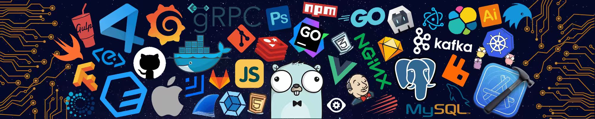

<h1 align="center">Hi 👋, I'm AlanHuang</h1>

<h3 align="center">QA Engineer & Full-Stack Developer | Building AI-powered Testing Tools</h3>

 ## 🛠️ Tech Stack

**Languages**

         

**Frameworks**

  ![MyBatis Plus](https://img.shields.io/badge/-MyBatis%20Plus-1E90FF?logo=data:image/png;base64,iVBORw0KGgoAAAANSUhEUgAAAEAAAAA3CAMAAACLkLyVAAAC+lBMVEUAAAAVEREXEhIZFBQekP8SDg4ekP8ekP8dkP8dj/8dkP8ckP9YRUVeSUlDcq4BAAAtIyMekP8VEREdkP8aFRUWEhIEAwMZFBQkHR0JBgYZj/8UEBBtVlZbR0cVEhIHBgYdkP8ekP8VEREOCwsAAAAekP8NCgodkP8GBAQGBgZZRkYdkP8IBgZpVFQ2KiohjPYcj/8QDAwckP8EAwMekP8IBgYdFxcWEREcFhYzKCgekP9tVVUqhuQeFxcEAwMTExMdkP8AAAAyJycdkP8kHBwTDw8zKCgdkP8BAAAQDg5aSEgAAAAdkP88SWAyJydbSEgICAhqVFRcSEgbj/8qaKlUREYeGBhOPT05LS0tf9MnUoFlT09kT09tVlZHODguIyMIBgYCAgIekP9eSkoEAwNbR0djTk5KOjoeFxdAdrRjTk5UQkJQPz8oh+ZtVVVtVlYzKChnUVEdkP8ekP88MDAej/8JBgYxgtYdj/9sVFRsVlY7eL1rVVUekP8pICAfGBhBMzM0KSlFNzdOPT0tIyMkHR0ZFBQXEhIbFhY4LCwvJSUjGxsmHh4xJycMCQlHODgdFxcVEBBIOTkhGhoSDg5tVlYJBwdKOzsEAwNdSUlXRERJOjoOCwtMPDw6Li42KysRDQ0HBQVYRkY+MTFfS0tAMjI9MDBjTk5TQUFRQEBENTU7Ly8rIiIAAABQPz9DNTVVQ0NUQkIaGhpmUFBhTU1bSEhpUlJaR0drVFQjk/8ej/1UZ4hOXnz7/f9isv8resv///8umP8gjfgkhudOaZB5ens6VnsaPF1LS0vw+P/V6/+y2f+dz/96vv9Jpf0jie4rgNccb780crVNbZpEaZlNVWtbWmpVU2HD4f+l0/9WrP9Qqf8/oP/29vZQovHG2euEtOIgftodedTPz8++xMmltsYsdMAzdb27u7s4drqurq40bKtBb6egoKAcXp15i5yZmZkcWpZBYoxDWHlAVHJAS2FHTF9YSk5NTU1FQktOQ0gaMUg9PT03Nzf8V4jUAAAAfXRSTlMA/hEJ+wTm7dpNPCQeEQT07ePOgXpaQjMnHQr38fDo5cK7u6yklZOMd2hbWE5IRTctLBj88+/l29LJxcPBtrW0raympI6NioiHg4CAdnBVUDo5GhH9+vnu7ezs6ebj393byMfGwcC2paCcm5WLhIF9cmtnZmVkXFlFNSoYGCGm6IgAAAT3SURBVEjHpZZ1XBNhGMfPiYiYlCB2d3d3d3d3d/u644ANlbEBusFwgGMyUHTbiYXd3d3d3f35+L53t4vdbTr9/XPvHzzfe36/59l7YJKq3AL7L5UHHrX+CzAXAL9/qcttPwTnBKBR2fJ+lb2D3Wrco4b9WKOFl1cdAJUztxvvB6A9xldv75IA5HKjg5KAaSFX61E+nl4ly+bGcroFqAyN18JqzfLy8PTyBFAe3p58QN6eVav2zJPPBaE1KvLpUj0f5aiLB/BhATkqjRu8acuWbdtWrWo8La8zQLBfibLe3Bv8YIZgNnXsVNSUad6ECKugikwXtSGp6gDUoXLtNTY+3pTJEWAXS/4GEAygfDCse1HjZkQwIwIygZpY6LQsO3csgQjeXfvqjVvFhEXOAGXGVJQxxwXUKoGsA2f3nL+48woTA0MYmtcZIE67snRAIbYFTvvPPnt58eDBHUgHL1yY6ATQIU4blRytaOBfTYb19gRSen3kHHpUlwYUpAGa2PClw1t1zRJUbqcf546QP+4D0EQakCM/CwhT4YcFhJMU4dTxYw9/ku9A1mJpQjMOkEioD+/n3r/72Kl9AOzetfft0aO/yCNgPr8soH7TNgGBKP8qLEBlIYiYTwfsgBsndl3dvR2c2PucJA/dOnQPTOUDaioj5CsilxZo2KpdP7lcE4EAqbiFUMd82wPsOg4bANf2HiLJrw+OnnYIoZhCIw+PzFiuClmWiq9TEynwgePrICHhsL2J6wDq9K6nJNJtMDAwOw/QVqmQI9/LQ5ISU3AixrAxTa9PJyiC4SPXBQrhVThJvtkO9pDFSlVkAbLCtIkw2ML6tRYiITTdCn8DVgISdIbQzy+4NG+evPPoLnTz2LdjD14P5bJRyUETSZQJXWia3hhvMhkIdQIkhH7/cP4MEKhP84I5ME6yYlQLyMQyZCLBsNGm3xqfadYRMYiwMT3Neun9Ew6SNai5fxDGU5VoBSJkMCbUOmgCtmA2q9V2gk2vN365cmkn1OXLW2aypVyOGkGO0ARqwUogQijVg97IXQ5VRVtcip8jjnK0GTfDPyaoUUBCms3KuxzyiC8TX1GOlAndOibIdD5hCCaWzBe2wDPB5KizEEyQLMFkypwkeaGV4i+Dml4GkwXtNBckQ+iOSRLqsTlCE3SOtrVop7kgEQGa6CVZP0EuF+YITeApdoIBEWz0KEZL1Qc1iJDLY2O5HxVaBnx9KiRYEEHHG0UliXr/wooIDSTwc4xJXJZIE4SjKJpdVF7TN1qppAgrICGDNpEYEpJEEXBcOIpOIvflCq+MzqZUIEIsJEQuhV2ooBMIQAQUA38UeRyWsELx1ckrKUIERQhHhIyw5SwhRTAK22THcm1UFEVQIgIVQ6SQ4BAkvwFZh7pr1mi1UatZgoYlhDEExyCn8D4kLfNviIuDhCiKEM0RaBMwCJUoyP68D2PnDVAcgQkSjYIlIEASHSSz03AHhIQ4hmAPUsEPMkwU5HhMoAoMQQsJrkeRShOGOX7Zq+RnTCDCn4NUB2GOCizOEkRBRjoEudZSTeoiKSMMkt1p/iiSaEI3TFIVuWEmJwt2WhhkyhzMiQq1rI0IfwhyANe/WD1GolG43OmGeTCXKtistoudVhWYgf1RhcqNcLbTBdrJJEvEjHml64p2ukCbQMwN5agZ0LF0/Ww0oV5T/25Bzv+7/g3GlGbW/DpATgAAAABJRU5ErkJggg==&logoColor=FFF) ![MyBatis](https://img.shields.io/badge/-MyBatis-544242?logo=data:image/png;base64,iVBORw0KGgoAAAANSUhEUgAAAEAAAAA3CAMAAACLkLyVAAAC+lBMVEUAAAAIBgYgGBgBAAAbEBDUAADUAAAJBgcTDg4FBATTAAAfGBjUAAACAQEEAgLTAAAHBgbTAQHUAAAFBATTAQEoHx8RDQ3UAAACAQE1KSkEAwMIBgXTAAAGBAQEAwMyJycHBgUPDAvRAQHPAAELCgkyJibDBwfQBgbACQoaFBTUAAA6Li0BAQHUAAAEAwMBAQHUAAAYFRQwJiYEAwPUAAACAgIUEhHUAAAHBgYVEhEEAgM/KyoEAwMyJycLCAjLAwPRAgIVEBFMTEieFBMIBwYDAwIqISAPDAwjHBsqISEVFBNHODgJBwctJCMbFRVENjbUAADTAADUAAA5LSwcFhbTAAAWExM7Li4RDg3RAAA6Li5AMTAHBQUMCQnTAADSAAA7Li7PAQHMAQGwrahPR0R2XVk3KyufDAokHh2LDAsZGxgWEhJGNzcBAQFbHh2zCQhHODhxFRPVAAAJBwcqIiIhGhoxJia/CgnUAAA2KipsGBhCNTUUEBCZEA8xJiYyJyc7Ly7SAABGODg5LCzUAAAAAAAFBAMOCwsKCAcpICAbFRUgGRknHx8RDg4iGxstIyMYEhIlHx4ZExMxJiYuJSUIBgYzKChFNjYQDAwMCgk8MC83Kys1KiokHh4UEA8DAgIkHR0/MjEWEREvJiY6Li00KSlHODg4LCsrIiIeGBgdFxdBMzJDNTRDNDQ7Li4+MC85LSwTDw8gGxvVAABWRENPPj5MPDxKOjqYFxZSQUDTAQEaGxleS0hbSUZYRkSmDQzFBQVgIyKhDAu+BgXJAwPQAQGEgn9HRkNoICDZHRxeFRSEExLVBgb+///44d+Yl5Tqf3vhSEQ+Li1DKCg3KCc9JiVTJSRKIyM/ICAtHhxYGBhxFxayDAy4BwfPAgL89PPw8O/j4+Hy19b1w8C8u7fapJ7vnpm/iYN0cW7kYF7NYFqVSEROLS0uLStWKykrKihyKSUzICA1Hx9ZHx54GhrVGhg6GBZtFRR3EhGTERGLEA+qDg6bCwrMAwO75rMFAAAAhHRSTlMAGAf8BfrkMAv29RTqw5GCenVwYFguJPHl4M2xn5t0Z0hAPjArEQ4LCPLw7+Db19TTx8O6uKalpYlpU0E4IR8bFBD+/vv5+Orn5t/d3drUyMbEw7i0m5l2cWhjW1hQTjYtKST+/v36+vn59/fx8Ovh1dTAv7KjlpOSj4iCgGxZUk9LNzVAtiZKAAAFXElEQVRIx6WUZVhTURzGr9scYQCKgiAqIXZ3d3d3d3e3ng02xtpNFrARAx0NohKSdnd3d7c+j+ccx+XubtOp75fdfTi/533f8/8fwqomLSX+S2NKgyn/BZgIQNV/OTe1VvFXAwAat2q12s29818Zr+tOdjCEzfYoDQAo62//+VqlQQPyT+1atVmd/UcAUIGwX1UBcMckP5fBZT3YQ1z8arP/CjC1LvDY0snfjV228dDGbGcYwK0BBVBm2+ZxY8e168CyTXDJBMC57IiJgSjDFBdn4OxRDKg5dlg9VZLeaIw3DBpVxibBbWhz90DyXwUA5YK+GKPqxUYnQoDemBAfr5y/ztGuSJ3QNTSHH5WqaNTqZJKgVCr7TbYHEFgX3WMgsWmAIkajjv1FMGKCYfFWm8dKMcjP5gDKfcPCSxfOI0J0tAoSIAARbHuo5j06wFS0H8rAdi7Ku5H75dj7wxfPnVWpVHo9tmAYVNMWgNu9v/d6X1xTK0AqLfNHXuH1bwXd9prUbZUNQA3u9qAdkXWarGhTybHTYEBXGtSxowXwt7S/jQ6cICBcyg+Z3afpyrUwhKWuv75ytND2wnqZAFqeSNbz8wFgoSf37k479PF7prPZqjJKFX+1LgHEaQWfigBNZ27dPti16yFhAfCjAsp4eZd3He9buQuro1OYCcDTCbWSqzfSzAEPT5zKyjp4Z0YecCOoqs/hcJ169R3YZHidXTtDQkKEWoFQKNRJJJe/msc4feJxVtahU9OP0EpoweFEbA8LjZTuEkp4clmMOlkj0iGC4MrV3EwK4MjJ+6lZWanGD2BRmwAW5fqYCEDWp07Uw3mJjtNpJQLB22uFFBdnTh58oX31LA3kzu3b0oEEsBrBDMFBoWJ+iFAgksVEJyUY9uzeZxBpBQIe783RgrwSD6cfPHp6HIBZTVwDKHvZNsJkYVcqzKCIVemVezL2paerJYgQJ798LbeoOMrx4wBqTktfBkFRM9KCDmbQROsTDBm70/fnJGOCSCSKuvDuWG5h0U2EyTxwM2/JyIpmb0tlTw4c49BI/k6hIE4eE6syKmGG9JwcuYkgj5LJzp+7dDE///Dh/PyXz9sRNLV1otWoNMAM+7MztDgEJigUGrTZiXAtjR0IulyZOAO2INMkJyUgC/uzs3kmglwuQwT8PJ1NqscgLFSeCS1E4hqjFDADtpCTHaUla5ApTM+TSjWMsBSrdY/goBQxyoBrjMc1ZkfpKCFkMZCQnJyoqk5YI7g6wRqlKENUTKwpQ44ADSRJQBZQDZUIa+qyDI8CtCCXqdEoQAsJIUIKAdWAQlRhWH1Oync3jYIAZcDTmCGBAKGEcpe4hjXWzjs02x4cHBwULt2JpxGPgoEHdxPvJQSUEGa2szzuWNGTy8WEFCm5UYk6Pt5ueg1NLRM4+PSI4GJCWFBQOF8ILWgUPD6fj96H1GICBMiRheoW6avV58BlgArGBHQZfKlULJViAq0GRZWatOMVvSI4UMgCDoEIoaHhkWKxFHmgh1CYG+hYsRwTHScJ2MIOCsEsBCRQDTi2d23EKVEEJQQiiDEBP5OUEBsJUr4tFnDMxDUjpFBDQIIAE5qyKN03pBym1bADEyxr6GM2xQ5kgD/UgAloL3vSrjDAk2NPCD4EpOIaljPoI1DutyHodzmgC0EXozzztyHE1BC9OxBWNMHTRgg6IbU3WSB9j5l21TCwMmFLDuUiLGsIo93l8DLEb1SjHNN8IMkiU34VWWc08Qe1b+FkI0Q4BLS0bp++ltiGZYh5Ix0IO9WxrU99pvk09PKZgMLbL0ap9uOr+TRr2L+hl3frNjUqOxI29RM10FYRtq0QcQAAAABJRU5ErkJggg==&logoColor=FFF)   

**Data**

      

**DevOps**

         

**Testing**

    

## 📊 Github Stats

<picture>
  <source media="(prefers-color-scheme: dark)" srcset="https://raw.githubusercontent.com/cmrhyq/cmrhyq/output/github-contribution-grid-snake-dark.svg">
  <source media="(prefers-color-scheme: light)" srcset="https://raw.githubusercontent.com/cmrhyq/cmrhyq/output/github-contribution-grid-snake.svg">
  
</picture>

## 🧑‍💻 About Me

- 🔭 I'm currently working on **[LLMTestAgent](https://github.com/cmrhyq/LLMTestAgent)** — an AI-powered API automation testing agent built on large language models
- 🌱 I'm passionate about combining **AI/LLM** with **software testing** to build intelligent QA solutions
- 🛠️ I specialize in **test automation**, **full-stack development**, and **DevOps tooling**
- 🏢 Based in **Shenzhen, China**
- ⚡ Fun fact: I turn manual testing pain into automated testing gain

## 🗒 Quick Links

	
	
	
	
	

